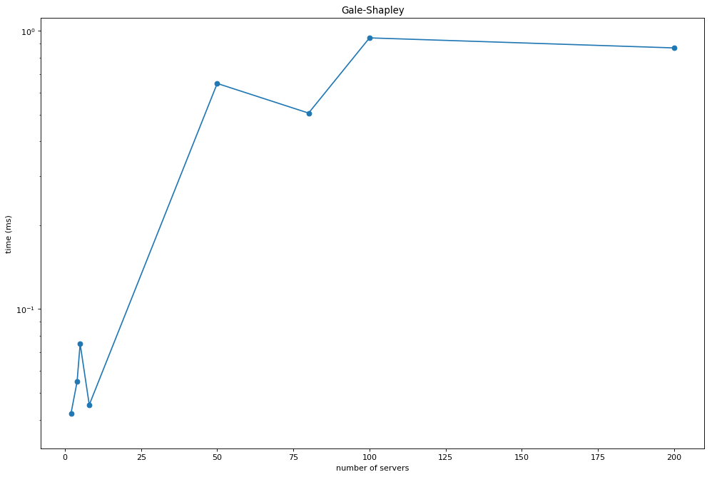
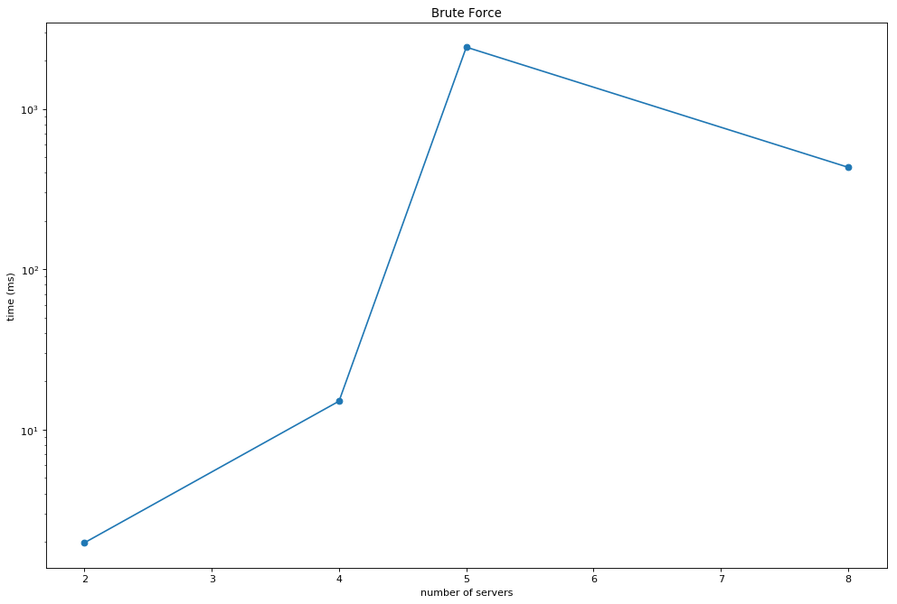
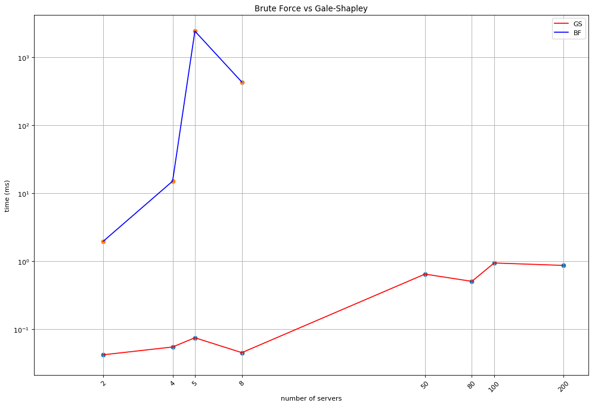

```python
import matplotlib.pyplot as plt
# number of servers - GS
x1 = [2, 4, 5, 8, 50, 80, 100, 200]
# number of servers - BF
x2 = [2, 4, 5, 8]
#time in nanosecs - GS
y01 = [42069, 54778, 74932, 45231, 646602, 505974, 942810, 867688]
y1 = [x * 1e-6 for x in y01]
#time in nanosecs - BF
y02 = [1972186, 15053303, 2424548929, 432113120]
y2 = [x * 1e-6 for x in y02]

# plot GS
plt.figure(figsize=(15, 10), dpi= 80, facecolor='w', edgecolor='k')

plt.scatter(x1, y1,)
plt.plot(x1, y1)
plt.yscale('log')
#plt.xscale('log')
plt.title('Gale-Shapley')
plt.ylabel('time (ms)')
plt.xlabel('number of servers')

plt.show()

# plot BF
plt.figure(figsize=(15, 10), dpi= 80, facecolor='w', edgecolor='k')

plt.scatter(x2, y2)
plt.plot(x2, y2)
plt.yscale('log')
#plt.xscale('log')
plt.title('Brute Force')
plt.ylabel('time (ms)')
plt.xlabel('number of servers')
plt.show()

# plot GS vs BF
plt.figure(figsize=(15, 10), dpi= 80, facecolor='w', edgecolor='k')

plt.scatter(x1, y1)
plt.plot(x1, y1, 'r', label='GS')
plt.scatter(x2, y2)
plt.plot(x2, y2, 'b', label='BF')
plt.yscale('log')
plt.xscale('log')
plt.title('Brute Force vs Gale-Shapley')
plt.ylabel('time (ms)')
plt.xlabel('number of servers')
plt.legend()
plt.xlim(1)
plt.xticks(x1, ('2', '4', '5', '8', '50', '80', '100', '200'), rotation=45)
plt.minorticks_off()
plt.grid()
plt.show()
```











```python

```
